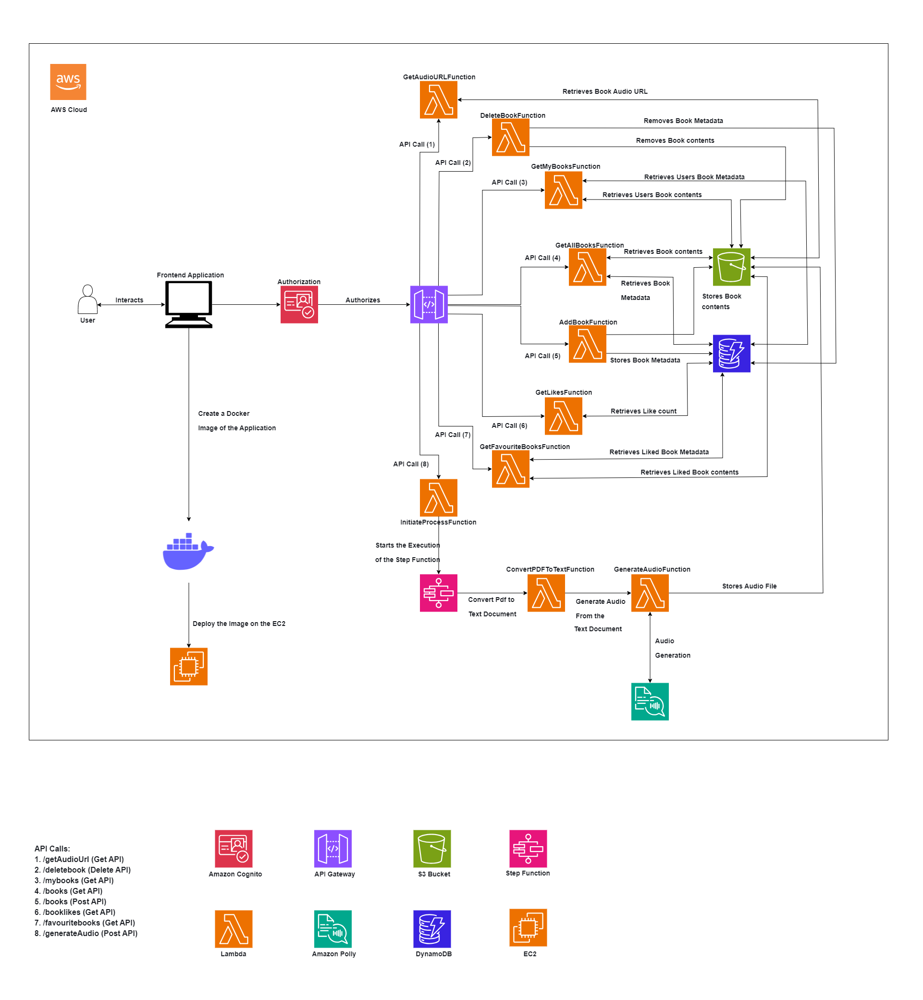
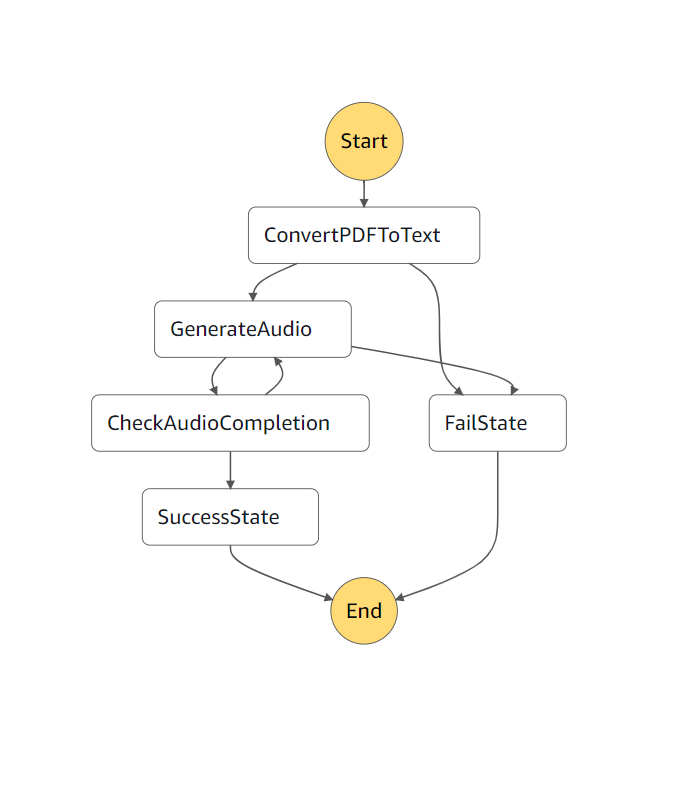

## Bookify

### Introduction

Bookify is a sophisticated platform that revolutionizes digital book management with innovative features. This platform allows users to seamlessly upload, manage, and explore a diverse library of books while offering unique features such as audio generation for text content. 

### Key features include
- Seamless Book Upload & Management: Users can easily upload and organize their book collections.
- Text-to-Speech Conversion: Leveraging Amazon Polly, the app converts book text into audio, making content accessible on the go.
- User Authentication & Personalization: Secure sign-in with Amazon Cognito and personalized book collections.
- Intuitive Frontend: Developed with React.js and deployed on EC2, ensuring a smooth and interactive user experience.
- Serverless Backend: Utilizing AWS Lambda for operations, S3 for scalable storage, and DynamoDB for efficient data management.
- Automated Audio Generation: Orchestrated with AWS Step Functions, showcasing advanced automation and scalability.

## Tech Stack:
- Frontend: React.js
- Backend: AWS Lambda, Node.js
- API Management: AWS API Gateway
- Orchestration: AWS Step Functions
- Storage: AWS S3, DynamoDB
- Text-to-Speech: Amazon Polly

Bookify combines modern web technologies with robust cloud services, creating a comprehensive solution for book enthusiasts and audio content consumers. 

## System Architecture

## Process Workflow design

